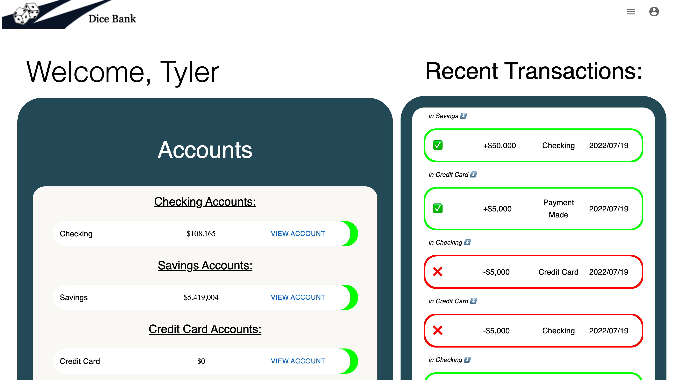
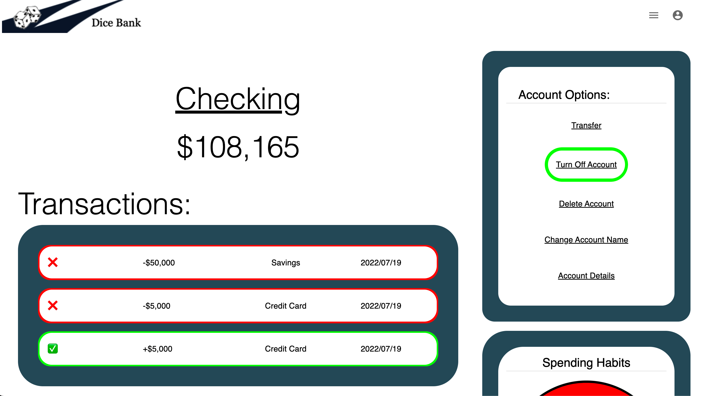
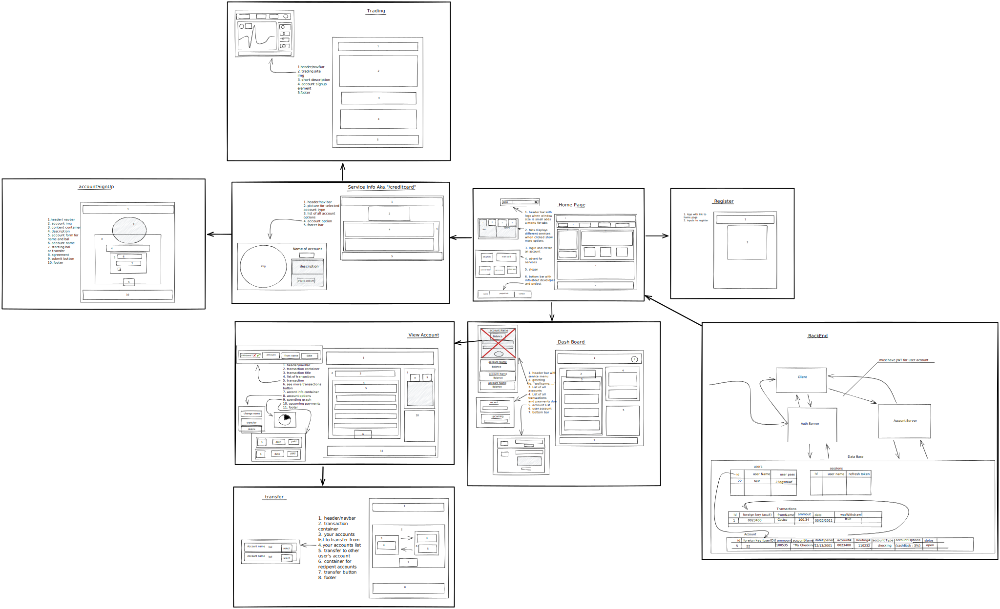

# Dice Bank

Dice bank is a parody of a real online bank website like
Bank of America or Chase Bank. Though the money may not be real
the functionality is. Dice Bank allows the user to create an
account allowing for login which is persisted throughout the app.
There are a verity of banking choices to choose form
whether it's a savings, checking, loan, or a trading account.
The user can transfer any of their "money" between the
accounts given the circumstance is right. In addition a
user can make monthly payments to their credit accounts which
if missed have consequences. Viewing a banking account allows
the user to see a list of transactions and account options
within the account options the account's number can be found
along with its secret these are used to transfer money to other
users.


coming soon:
If a user makes a trading account they are able to
connect it to their TEMP NAME account enabling the user the
ability to buy and sell stocks.
## Technology

NodeJs and PosgreSQL are required to run this project locally

FrontEnd:


Backend:


## Color Reference
https://hexcolorpedia.com/color/?q=325765
| Color             | Hex                                                                |
| ----------------- | ------------------------------------------------------------------ |
| Petro Blue | #325765 |
| Fire Axe Red | #cc171d |
| Yankees Blue |  #162337 |


## Screenshots

### Home Page


### Dashboard


### View Account


### Planning
svg and excalidraw file in ReadmeFiles



## Demo


https://user-images.githubusercontent.com/62031957/179885998-ee6db999-be9f-4960-b92a-8e25bcbeb904.mp4


## Deployment

PUT DEPLOYED LINK HERE

Dice bank is deployed on AWS

## Run Locally

Clone the project
```bash
  git clone https://github.com/Tyl3r-Engel/Dice_Bank.git
```

Go to the bank
```bash
  cd bank
```

Install dependencies
```bash
  npm install
```

Add pool.js to the database directory
```javascript
  const { Pool } = require('pg')

  const pool = new Pool({
    host: 'localhost',
    database : 'dice_bank'
  })

  module.exports = pool;
```

Create a .env file in the bank directory
```javascript
  ACCESS_TOKEN_SECRET = *
  REFRESH_TOKEN_SECRET = *
```
*Open your termainal and type 'node' then run
```javascript
  console.log(require('crypto').randomBytes(64).toString('hex'))
```
copy the output and replace the * with it, do this for both the ACCESS_TOKEN_SECRET and REFRESH_TOKEN_SECRET

Run build
```bash
    npm run build
```

Init Db the account server
```bash
  npm run db-init
```

Start Server
```bash
  npm run server
```

In the browser go to http://localhost:7777

## Lessons Learned

Throughout the month or so it took to build Dice Bank I
never lost site or joy in the project although the scale of it
all was lost on me till right about the half way point when
I realized there was still along way to go. Never the less bit
by bit I took it peace by peace I worked away at till it
resembled the image in my head. There where lots of new and
interesting things that I learned while building Dice Bank but the
most challenging one was working with Json Web Tokens(JWT).
JWTs where a challenging for me at the beginning but after hours
of researching and implementing them to the extent that I have now,
I would say I have solid understanding of how they work and operate.

## Optimizations / bugs

At this point there are no major Optimizations I want to make,
however there are components that could use to be rewritten,
logic that could probably be simplified, code formatting and
bug squashing to be done.

note: the backend will need to be added to for other app interaction

## bugs
- 01# This bug happens after logout, the user can use the browsers navigation arrows to navigate back into the account.
   - 1.1 fix: It was seen that the navigation of the site by the arrows to '/dashboard' would seem to retain state from when the page was logged in and some how able to use an old access token to request for the users info. the jwt cookie is removed however and a refresh will send the user back to the home page. I was able to make a work around by making the access tokens last 30s so they would expire briefly after logout.

    - 1.2 fix: changed the verifyJWT on the server to check to see if the user has a refresh token and if not to send a status of 401. This change now makes to no longer possible to use the navigation arrows to back track into a logged out account HOWEVER the page still does load residual data and then is promptly redirected.

    - 1.3 update: after working on the dashboard controller and the client side dashboard this bug is now just about un-noticeable only when the network tab is reviewed can you see that a get request was still made getting the prev users account info, only after the first attempt this happens. If you tried to navigate with the arrows back a second time you would see in the network tab that the get requests to dashboard have failed although a refresh request does go through and gets an access token, this access token does not appear to work and is as useful as an expired one.

    - 1.4 fix: This bug has now been fixed with the addition of 'Cache-Control: no-cache' as a header in the response from the auth server this bug hasn't been able to be recreated.

    - 1.4 update: this bug is still quite re-creatable

    - 1.5 fix: added { "cache-control" : "no-store" } to dashboard GET res
## Roadmap

#### What's next?

As for now Dice Bank is getting a pin
while work starts on the stock trading app to go along side it.

- index database

- Getting tests written

- Optimizations


## Authors
Tyler Engel

### Want to get in touch?
[](https://www.linkedin.com/in/tylerengel/)
[](https://github.com/Tyl3r-Engel)
[](mailto:engelcrag@gmail.com)
